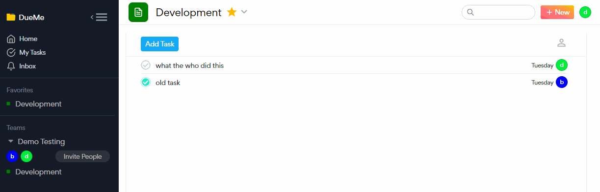
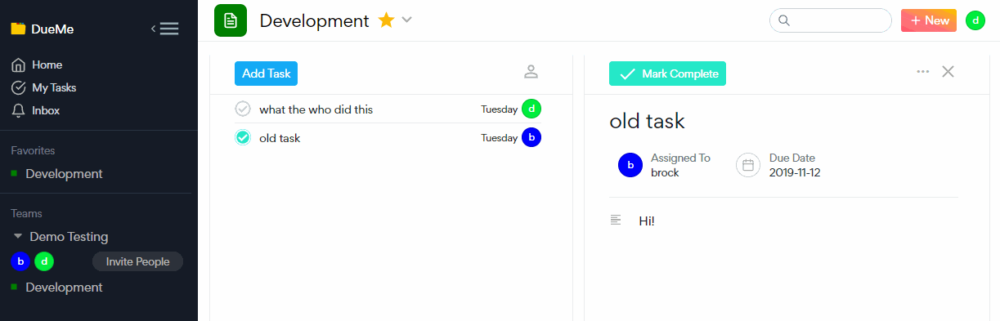

# DueMe


A task Management site where a user can create a team with other users, set projects, and manage tasks.


<!-- ## Background and Overview
## Functionality and MVP
- [ ] User Auth
- [ ] Projects
- [ ] Teams
- [ ] Tasks
- [ ] Bonus: Chat
- [ ] Bonus: Calendar
- [ ] Bonus: File Upload -->

## Technologies
* MERN (MongoDB, Express, React, and Node)
* GraphQL
* AWS
* Frontend: React/Apollo
* Backened: MongoDB/Express

<!-- ## Group Members and Work Breakdown
Abby, Anoush, Brock, Carlos
### Day 1 - 2
* User Auth
* MongoDb Setup
* React Skeleton
* models (Teams, Users, Tasks, Projects)
* Home Page (splash)

### Day 3 - 5
* User Dashboard (sidebar)
    - tasks (add new, edit, delete, complete)
    - project/team (add new, edit, delete, complete)

### Day 5 - 7
* Chat
* Calendar
* File Upload


#### Bonus:
* Timeline
 -->

## Features:

### Collapsing components with smooth animations


Get more space to work with by hiding stuff you don't need! These slide out animations are simple that it takes only a few lines of code to implement.

```css
.sidebar{
    transition: margin-left 250ms ease-out,transform 250ms ease-out;
}

.collapsed{
    margin-left: -244px;
}

```

The collapsed class is removed whenever a component is brought back from being hidden and that is done by a simple repainting of DOM elements.

```javascript
    handleSidebarHide() {
        const sidebar = document.getElementById("sidebar")
        const headerHam = document.getElementById("main-ham")
        sidebar.classList.add("collapsed")
        headerHam.classList.remove("hidden-ham")
    }
```

### On-the-Fly Editing


Thanks to Apollo/GraphQL's malleable queries and onBlur events, editing can be done in this nature without having to press a submit button. 


```html
<Mutation mutation={UPDATE_TASK_TITLE}>
    {(updateTaskTitle, data) => (
            <form
            // the usual submit callback in case the enter key is pressed
            >
                <input
                    value={this.state.title}
                    onChange={this.fieldUpdate("title")}
                    onBlur={e => {
                        e.preventDefault();
                        updateTaskTitle({
                            variables: { id: this.props.task._id, title: this.state.title }
                        }).then(() => this.setState({ editing: false }));
                    }}
                />
            </form>
        </div>
    )}
</Mutation>

```

The displayed text is updated locally in the component AND a query is sent to have it changed in the database. This saves having to make an unnecessary refetch query. 